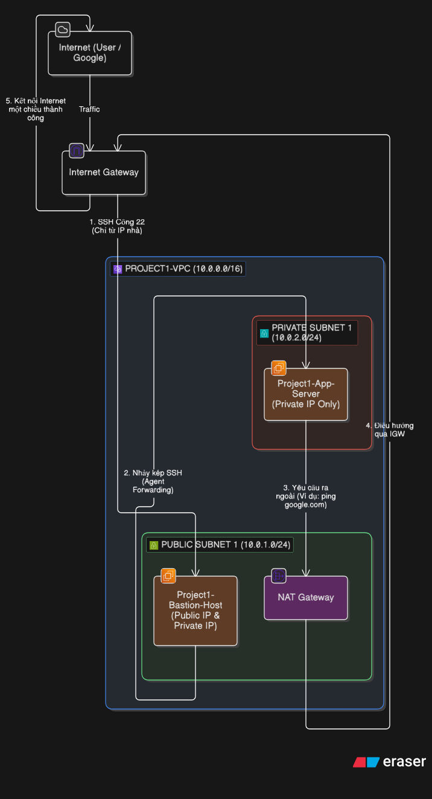
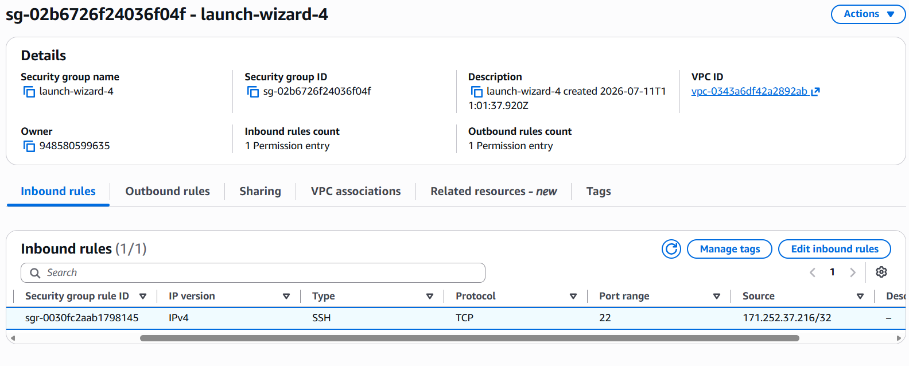
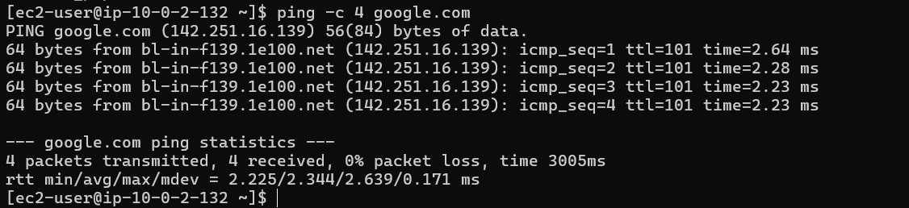

# AWS Lab: Triển khai Hạ tầng VPC với Bastion Host & NAT Gateway

## 📐 Sơ đồ kiến trúc mạng
Bản thiết kế hệ thống được vẽ qua Eraser.io:

### Thông số cấu hình chính:
* **VPC:** Dải IP `10.0.0.0/16`.
* **Public Subnet (`10.0.1.0/24`):** Chứa Bastion Host và NAT Gateway.
* **Private Subnet (`10.0.2.0/24`):** Cô lập App Server bên trong, không gán IP Public để tránh bị quét từ Internet.

---

## 🔒 Cấu hình Bảo mật & Kiểm thử thành công

### 1. Luật Tường lửa (Security Groups)
Thiết lập phân quyền nghiêm ngặt để siết chặt đầu vào:
* **Bastion-SG:** Chỉ mở cổng 22 (SSH) cho duy nhất IP mạng tại nhà (định dạng `/32` như hình dưới).
* **App-Server-SG:** Chỉ chấp nhận kết nối SSH nếu nguồn xuất phát từ đúng mã ID của Bastion-SG. Kẻ gian từ ngoài Internet hoàn toàn không thể thâm nhập trực tiếp.

### 2. Truy cập từ xa an toàn (SSH Agent Forwarding)
Sử dụng cơ chế chuyển tiếp key ngầm từ máy cá nhân qua Bastion để nhảy vào App Server. Tuyệt đối không lưu file private key `.pem` trên cloud, đảm bảo an toàn an ninh hệ thống.

### 3. Đường mạng một chiều qua NAT Gateway
Kiểm tra App Server vùng kín đã có thể ra Internet tải các gói cập nhật phần mềm (`apt update`) thành công, trong khi chiều ngược lại từ Internet vẫn bị chặn đứng.

---

## 🚀 Kịch bản lệnh vận hành
Toàn bộ chuỗi lệnh Terminal dùng trong quá trình thiết lập và test cú nhảy kép được lưu tại file `setup-commands.sh`.
